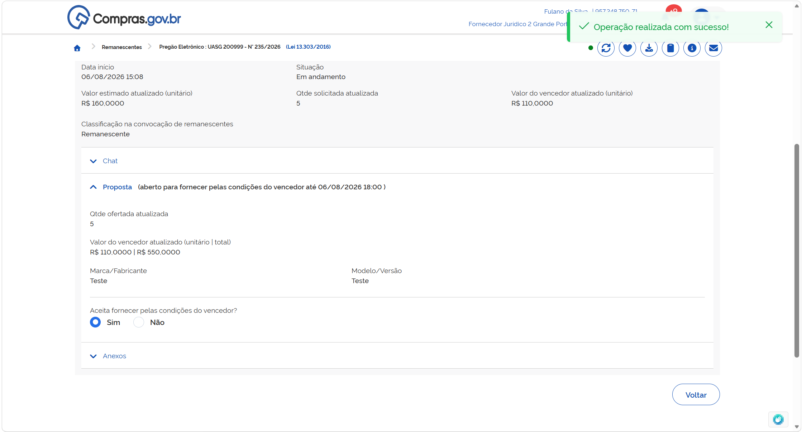
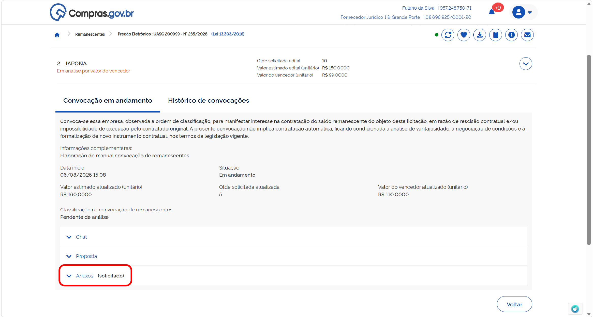

  <button onclick="window.print()" style="background-color: #0056b3; color: white; padding: 10px 20px; border: none; border-radius: 5px; font-size: 16px; cursor: pointer; box-shadow: 0 2px 4px rgba(0,0,0,0.2);">
    🖨️ Imprimir esta página
  </button>

# CONVOCAÇÃO PELAS CONDIÇÕES DO VENCEDOR

Nesta etapa, você formaliza o aceite para assumir o contrato pelo mesmo preço do licitante vencedor do processo licitatório.

**Passo 1:** Após selecionar a opção desejada (aceitar ou recusar as condições do vencedor), o sistema pedirá para você confirmar a sua opção. Verifique as informações e confirme.

**Passo 2:** Caso tenha selecionado a opção incorreta ou tenha mudado de ideia antes do encerramento do prazo, é possível alterar a sua manifestação clicando em "Alterar opção".

**Passo 3:** Confirme a nova opção selecionada para que o sistema registre a sua alteração.

**Passo 4:** Sendo o seu aceite confirmado e sendo a sua empresa a próxima na ordem de classificação, o órgão responsável fará a solicitação de envio da documentação de habilitação e proposta atualizada. Acompanhe as mensagens pelo chat do sistema.

**Passo 5:** Para enviar os documentos solicitados, acesse a área de anexos do item e faça o upload dos arquivos (proposta e documentos de habilitação).

**Passo 6:** Após anexar todos os documentos necessários, não se esqueça de clicar em "Encerrar envio de anexo" para que o pregoeiro/agente de contratação seja notificado de que você concluiu o envio.

  <button onclick="window.print()" style="background-color: #0056b3; color: white; padding: 10px 20px; border: none; border-radius: 5px; font-size: 16px; cursor: pointer; box-shadow: 0 2px 4px rgba(0,0,0,0.2);">
    🖨️ Imprimir esta página
  </button>

