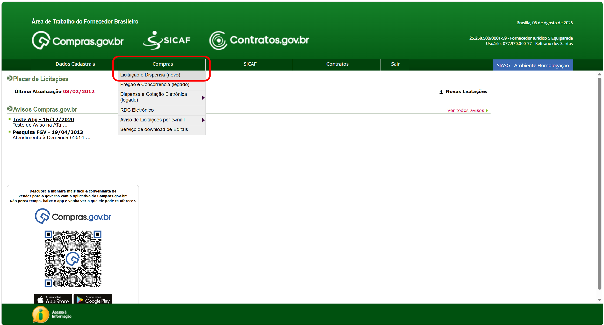
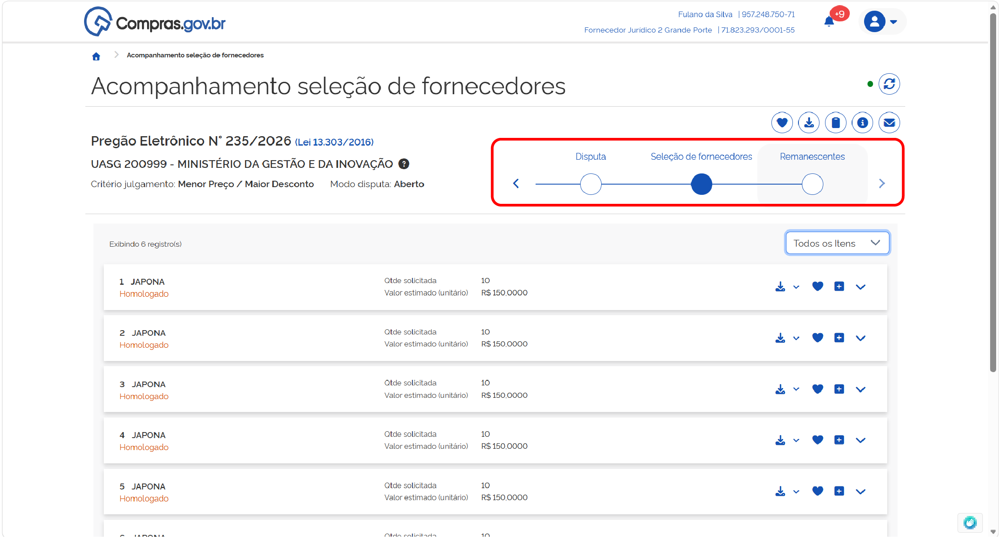
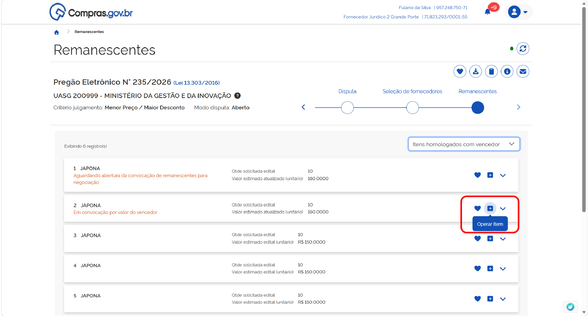

  <button onclick="window.print()" style="background-color: #0056b3; color: white; padding: 10px 20px; border: none; border-radius: 5px; font-size: 16px; cursor: pointer; box-shadow: 0 2px 4px rgba(0,0,0,0.2);">
    🖨️ Imprimir ou baixar o manual completo
  </button>

# ACESSANDO UMA CONTRATAÇÃO HOMOLOGADA

**Passo 1:** Acesse o Portal de Compras do Governo Federal e clique em “Acesso ao Sistema”.

**Passo 2:** Escolha o perfil Fornecedor Nacional e clique em “Entrar com Gov.br”.

Ou selecione o perfil Fornecedor Estrangeiro e utilize suas credenciais para login.

**Passo 3:** No menu “Compras”, acessar a opção “Licitação e dispensas (novo)”.

**Passo 4:** Você poderá acessar uma convocação de remanescentes acessando as notificações do sistema na lateral direita, ou acessar a pesquisa na aba “Todas as Compras” e pesquisando o número da contratação desejada.

**Passo 5:** Acesse a contratação clicando na opção “Acompanhar compra”.

**Passo 6:** Acesso a linha do tempo da contratação em Remanescentes.

 

# MANIFESTANDO INTERESSE EM PARTICIPAR DE UMA CONVOCAÇÃO DE REMANESCENTES

A convocação de remanescentes acontecerá em duas etapas, sucessivas[cite: 1]:
* Aceite para assumir o contrato pelo mesmo preço do licitante vencedor do processo licitatório[cite: 1];
* Caso a primeira etapa não tenha sucesso, será aberta a possibilidade de aceite para assumir o contrato após negociação de valor, incluindo a possibilidade de manutenção da proposta original do licitante interessado[cite: 1].

**Passo 1:** Para formalizar sua intenção de participar em uma convocação de remanescentes, selecione o item em que deseja atuar e clique em “Operar item”[cite: 1].

**Passo 2:** Leia as informações sobre o item, uma vez que os valores podem sofrer atualizações[cite: 1].

**Passo 3:** No campo “Proposta”, será solicitada a manifestação de interesse em participar da convocação de remanescentes, na condição atual[cite: 1].

# CONVOCAÇÃO DE CONTRATAÇÃO DE REMANESCENTES PELAS CONDIÇÕES DO VENCEDOR

O processo de convocação de remanescentes começa pela oportunidade de assumir o contrato nas mesmas condições do fornecedor[cite: 1]. Para manifestar seu aceite ou não de assumir o contrato pelas condições do vencedor, siga as instruções abaixo[cite: 1]:

**Passo 01:** No cabeçalho do campo proposta, será indicado o prazo para manifestação de interesse de fornecer pelas condições do vencedor[cite: 1]. Revise as informações sobre as condições da contratação e selecione a opção desejada[cite: 1]. Confirme sua opção[cite: 1].

**Passo 02:** Durante o prazo de manifestação indicado, você poderá alterar sua opção[cite: 1]. Selecione a nova opção e confirme a opção[cite: 1].

Finalizado o prazo para manifestação de todos os fornecedores que participaram do processo, o agente de contratação partirá para a etapa de habilitação e julgamento desta convocação de remanescentes[cite: 1]. 

**Passo 03:** Acesse o item em convocação de remanescentes selecionando a opção “Operar item”[cite: 1].

Para visualizar quais documentos foram solicitados, acesse a seção “Anexos”[cite: 1].

Leia a justificativa e conteúdo da solicitação e encaminhe os documentos necessários[cite: 1]. Para tanto, leia os avisos de sistema e declare ciência[cite: 1].

Anexe todos os arquivos clicando no local indicado, ou arrastando os arquivos[cite: 1]. Finalize o upload de todos os documentos e clique em “Encerrar envio de anexos”[cite: 1].

**Passo 04:** Para visualizar e responder as mensagens encaminhadas pelo agente de contratação responsável, selecione a seção “Chat”[cite: 1].
A área serve para comunicação entre as partes, visando sanar dúvidas sobre o processo[cite: 1]. Preencha a mensagem desejada e clique em “Enviar” para encaminhá-la ao agente de contratação[cite: 1].

**Passo 05:** Caso a documentação da proposta de fornecimento não atenda aos requisitos de edital, o fornecedor será desclassificado[cite: 1]. Assim, ficará na tela a indicação “Classificação na convocação de remanescente: Desclassificado”[cite: 1].
O fornecedor não estará apto a participar novamente desta convocação de remanescente enquanto o status de “Desclassificado” persistir[cite: 1].
ATENÇÃO: Recursos referentes à desclassificação deverão ser encaminhados diretamente ao órgão contratante[cite: 1].

**Passo 06:** Caso a documentação de habilitação não atenda aos requisitos de edital, o fornecedor será inabilitado[cite: 1]. Assim, ficará na tela a indicação “Classificação na convocação de remanescente: Inabilitado”[cite: 1].
O fornecedor não estará apto a participar novamente desta convocação de remanescente enquanto o status de “Inabilitado” persistir[cite: 1].
ATENÇÃO: Recursos referentes à desclassificação deverão ser encaminhados diretamente ao órgão contratante[cite: 1].

**Passo 07:** Caso toda a documentação apresentada esteja de acordo com as exigências de edital, o fornecedor será aceito para fornecimento de remanescente contratual[cite: 1]. Assim, ficará na tela a indicação “Classificação na convocação de remanescente: Aceito e habilitado”[cite: 1].

**Passo 08:** Para a formalização do processo, o agente de contratação encerrará a convocação de remanescentes[cite: 1]. Assim, ficará na tela a indicação “Situação: Encerrada”[cite: 1].

